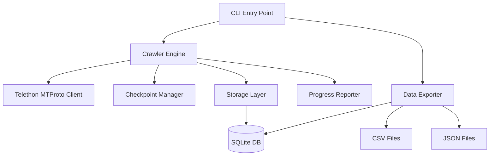

# System Design & Architecture

## Architecture Overview
**What is the high-level system structure?**



- **CLI**: argparse-based command line interface
- **Crawler Engine**: Orchestrates message fetching with rate limiting and error handling
- **Telethon MTProto Client**: Handles Telegram API communication
- **Checkpoint Manager**: Tracks last crawled message ID per channel for incremental updates
- **Progress Reporter**: Displays channel name, message count, crawl rate, and ETA during crawl
- **Storage Layer**: SQLAlchemy-based persistence to SQLite
- **Data Exporter**: Exports SQLite data to CSV/JSON

## Data Models
**What data do we need to manage?**

### Channel
| Field | Type | Description |
|-------|------|-------------|
| id | INTEGER PK | Telegram channel ID |
| username | TEXT | Channel username (unique) |
| title | TEXT | Channel display name |
| description | TEXT | Channel bio/description |
| member_count | INTEGER | Subscriber count |
| created_at | TIMESTAMP | First crawl timestamp |
| updated_at | TIMESTAMP | Last crawl timestamp |

### Message
| Field | Type | Description |
|-------|------|-------------|
| id | INTEGER AUTO PK | Auto row ID |
| msg_id | INTEGER | Telegram message ID |
| channel_id | INTEGER FK | Reference to Channel |
| date | TIMESTAMP | Message timestamp (UTC) |
| text | TEXT | Message text content |
| views | INTEGER | View count |
| forwards | INTEGER | Forward count |
| reply_to_msg_id | INTEGER | Parent message ID (replies) |
| media_type | TEXT | Type of media (photo/video/document/null) |
| media_file_ref | TEXT | Media file reference string |
| grouped_id | INTEGER | Album grouping ID |
| post_author | TEXT | Author signature |
| edit_date | TIMESTAMP | Last edit timestamp (only latest, no history) |
| is_pinned | BOOLEAN | Whether message is pinned |
| crawled_at | TIMESTAMP | When we fetched this message |

**Constraints**: `UNIQUE(channel_id, msg_id)` — Telegram message IDs are only unique within a channel.

### Reaction
| Field | Type | Description |
|-------|------|-------------|
| id | INTEGER PK AUTO | Row ID |
| message_id | INTEGER FK | Reference to Message |
| channel_id | INTEGER FK | Reference to Channel |
| emoji | TEXT | Reaction emoji |
| count | INTEGER | Reaction count |

### Checkpoint
| Field | Type | Description |
|-------|------|-------------|
| id | INTEGER PK AUTO | Row ID |
| channel_id | INTEGER FK | Reference to Channel |
| last_message_id | INTEGER | Last successfully crawled message ID |
| direction | TEXT | "forward" or "backward" |
| updated_at | TIMESTAMP | Last checkpoint save |

## API Design
**How do components communicate?**

- Internal Python API only (no HTTP endpoints)
- CLI subcommands:
  - `telegram-crawler login` — Interactive auth (phone + code), saves session file
  - `telegram-crawler crawl <channel>` — Crawl channel messages
  - `telegram-crawler crawl <channel> --from 2024-01-01 --to 2024-12-31` — Date-range crawl (full crawl only, ignored for incremental)
  - `telegram-crawler crawl ch1 ch2 ch3` — Crawl multiple channels
  - `telegram-crawler export <channel> --format csv|json` — Export data
  - `telegram-crawler list` — List crawled channels
  - `telegram-crawler stats <channel>` — Show crawl statistics

### Auth Flow
- First-time: `telegram-crawler login` → prompt phone number → enter verification code → session file saved to `~/.telegram-crawler/session.session`
- Subsequent runs: session file reused automatically, no re-auth needed
- Session stored alongside DB or configurable via `--session-dir`

## Component Breakdown
**What are the major building blocks?**

```
telegram_crawler/
├── __init__.py
├── cli.py              # CLI entry point (argparse)
├── crawler.py          # Core crawler engine
├── client.py           # Telethon client wrapper
├── models.py           # SQLAlchemy data models
├── storage.py          # Database operations (CRUD)
├── checkpoint.py       # Checkpoint/resume logic
├── exporter.py         # CSV/JSON export
├── rate_limiter.py     # Token bucket rate limiter
├── progress.py         # Progress reporting (message count, rate, ETA)
└── config.py           # Configuration (credentials, paths)
```

## Design Decisions
**Why did we choose this approach?**

- **Telethon over Pyrogram**: Telethon has more mature history fetching API (`iter_messages`), better documentation for large-scale crawling, and wider community support.
- **SQLite over DuckDB/MongoDB**: Zero-config, single-file, excellent read performance for analytics workloads under millions of rows. SQLAlchemy provides portability if migration needed later.
- **SQLAlchemy ORM**: Type-safe models, migration support (Alembic-ready), and query flexibility.
- **Token bucket rate limiter**: Smooth request distribution avoids Telegram API throttling while maximizing throughput.
- **Checkpoint-based incremental crawl**: Store last message ID per channel, resume from there on next run.
- **Date-range vs incremental**: `--from`/`--to` only applies to full (first-time) crawl. Incremental crawl always resumes from checkpoint, date flags ignored.
- **Composite UNIQUE constraint**: `UNIQUE(channel_id, msg_id)` on Message table prevents duplicates since Telegram msg_id is only unique within a channel.

## Non-Functional Requirements
**How should the system perform?**

- Performance: Process 1000+ messages/minute (limited by Telegram API rate)
- Storage: SQLite handles millions of rows with proper indexing
- Reliability: Auto-retry on transient API errors; `FloodWaitError` handled by awaiting the exact seconds Telegram specifies (not generic exponential backoff)
- Rate limiting: Token bucket ensures ≤30 requests/second to Telegram
- Indexes: `idx_message_channel_date` on `Message(channel_id, date)`, `idx_message_channel_msgid` on `Message(channel_id, msg_id)`, `idx_reaction_message` on `Reaction(message_id, channel_id)`